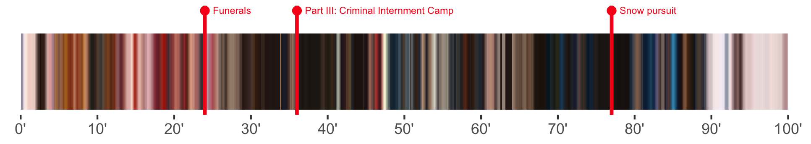
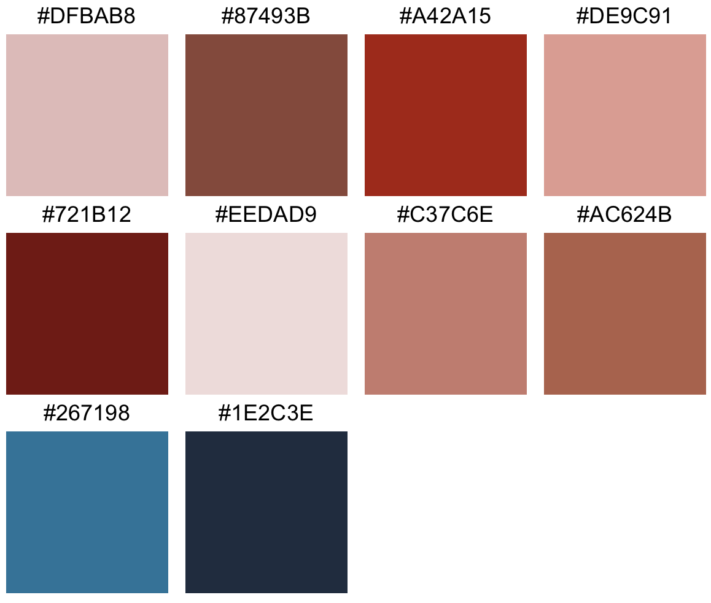

# movieaRt

<!-- badges: start -->
[](https://www.tidyverse.org/lifecycle/#experimental)
[](https://github.com/js2264/movieaRt/actions)
<!-- badges: end -->

## Getting main colors per frame

```r
video <- "path/to/video.mp4"
makeFrames(video, outdir = 'frames/')
list_colors <- getColorList(dir = 'frames/')
```

## Processing the colors and plotting a color story

```r
data(colors) # this set of colors was extracted from The Grand Budapest Hotel, directed by Wes Anderson.
main_colors <- filterColors(colors)
average_colors <- smoothColors(main_colors)
movieStack(average_colors)
```


Timeline can be added using the `nsec` argument: 

```r
movieStack(average_colors, nsec = length(colors))
```

Timepoints can be added using the `timepoints` argument: 

```r
tp <- list(
    '24' = 'Funerals', 
    '36' = 'Part III: Criminal Internment Camp', 
    '77' = 'Snow pursuit'
)
movieStack(average_colors, nsec = length(colors), tp = tp)
```



## Tidy workflow

```r
makeFrames("path/to/video.mp4")
p <- getColorList() %>% 
    filterColors() %>% 
    smoothColors() %>% 
    movieStack()
```

## Movie palette

```r
data(colors)
palette <- colors %>%
    purrr::flatten() %>% 
    unlist() %>% 
    unique() %>% 
    moviePalette()
checkPalette(palette, unique = TRUE)
```

